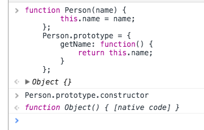
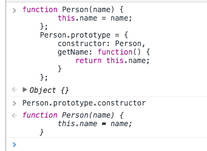

## js 类与继承

在[this,constructor,prototype](https://github.com/yukiyuki1900/JStalk/tree/master/this%2Cconstructor%E5%92%8Cprototype)这篇文章的最后有一个例子：

```
    function Person(name) {
        this.name = name;
    };
    Person.prototype = {
        getName: function() {
            return this.name;
        }
    };
```

因为将Person.prototype赋值为一个对象，所以Person.prototype被重写了，这样虽然对prototype属性的使用不会产生什么区别，但是我们知道，每次创建一个函数的时候，都会自动创建它的**prototype**对象，而这个prototype对象也会自动有一个**constructor**的属性，这个属性指向新创建的函数。

在上述例子里，由于prototype被重新赋值为新对象，所以自然**constructor**属性也就变成新对象的**constructor**属性（指向Object构造函数）



如果**constructor**值很重要，那就在**prototype**里将**constructor**赋值为**Person**就好了

```
    function Person(name) {
        this.name = name;
    };

    Person.prototype = {
        constructor: Person,
        getName: function() {
            return this.name;
        }
    };
```



### 原型链

在上述的例子里，Person.prototype被重写为一个对象的实例，并通过这样的方式使得Person的实例能享有对象的属性。

或者换一个方式说，通过Person.prototye被重写为另一个构造函数的实例，通过这种方法来享有另一个构造函数的属性来实现继承。

```
    function Animal(age) {
        this.age = age;
    };

    Animal.prototype.getAge = function() {
        return this.age;
    }

    function Person(name) {
        this.name = name;
    };

    Person.prototype.getName = function() {
        return this.name;
    };

    //重写prototype
    Person.prototype = new Animal(18);

    var person = new Person('Yuki')
    person.getAge();   //18
```

上面的例子里Person.prototype被重写为Animal的一个实例，这样Person的原型则会享有Animal实例的所有属性和方法，而且这个时候Person.prototype.construcor为Animal实例的constructor，也就是function Animal(age) {}

不过呢，这种纯原型链的继承是有一些缺陷的。比如下面这种：

```
    function Animal(age) {
        this.age = age;
        this.children = [];
    };

    function Person(name) {
        this.name = name;
    };

    //重写prototype
    Person.prototype = new Animal(18);
    
    var person1 = new Person('Yuki')
    person1.children.push('Lily');

    var person2 = new Person('Jack')
    console.log(person2.children);   //'Lily'
```

可以看到其实Person的两个实例，都共享了一个children的字段，当对children字段进行push操作(这样不会影响到这个属性的索引)，两个Person的实例的children值都发生了变化。

这是因为这个时候Person.prototype指向了Animal，因为Person没有一个叫children的属性，所以会沿着原型链往上找到Animal的children属性，所以两个实例共享了一个children值。如果是person1的children值进行赋值操作，那相当于在Person本身增加了一个children的属性，这个时候就会直接用Person自身的children属性，而不会找到Animal的。

```
    Person.prototype = new Animal(18);
    
    var person1 = new Person('Yuki')
    person1.children= ['Lily'];

    var person2 = new Person('Jack')
    console.log(person2.children);   //[]

```

### 结合构造函数

鉴于使用原型链带来的一些让人意想不到的“坑”，实现继承的时候往往会借用构造函数。

其实就是在子类构造函数里调用父类构造函数，并且通过call()/apply()方法更改构造函数调用时的this环境，实现每次调用父类构造函数的都能创建一个新的实例，使得两个子类构造函数的实例继承的是不一样的父类构造函数实例。（说的就和绕口令一样/(ㄒoㄒ)/~~）

不过呢，如果每次创建子实例的时候都要继承一个父实例，那继承不就没有意义了嘛！还不如直接把父构造函数的属性写在子构造函数里呢。这个时候，父构造函数就要结合prototype了，毕竟父实例是共享父构造函数的prototype的嘛~~（还是很绕啊肿么办~/(ㄒoㄒ)/~~）

看下代码吧~~

```
    function Animal(age) {
        this.age = age;
        this.children = [];
    };

    Animal.prototype.getChildren = function() {
        console.log(this.children);
    }

    function Person(name, age) {
        //函数内调用父构造函数，继承父类构造函数内属性，还可以实现从子实例往父实例传参
        Animal.call(this, age);

        this.name = name;
    };

    Person.prototype.getName = function() {
        return this.name;
    };
    
    //继承父类prototype方法
    Person.prototype = new Animal();

    var person1 = new Person('Yuki', 18)
    person1.children.push('Lily');
    console.log(person2.children);   // ['Lily']
    person1.getChildren();           // ['Lily']

    var person2 = new Person('Jack', 20)
    console.log(person2.children);   // []
    person2.getChildren();           // []

```

